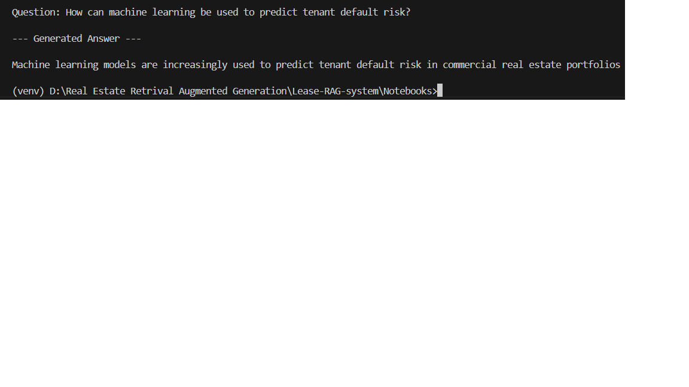

# 🚀 AI-Powered Lease Intelligence System (RAG)

---

## 🔍 Problem

Lease agreements and real estate contracts are long, clause-heavy, and difficult to analyze quickly.

Finance, legal, and operations teams often spend significant time:
- Manually scanning documents  
- Extracting key clauses  
- Validating obligations and risks  

Traditional keyword search fails to capture meaning, leading to inefficiencies and missed insights.

---

## 💡 Solution

Developed a **Retrieval-Augmented Generation (RAG) system** that allows users to query lease documents in natural language and receive **context-aware, document-grounded answers**.

The system ensures responses are derived strictly from the source document, reducing hallucination and improving reliability.

---

## 📈 Business Impact

- Reduces manual contract review time by ~60–70%  
- Enables faster financial and compliance decision-making  
- Improves accessibility of unstructured contract data  
- Demonstrates scalable approach to document intelligence systems  

---

## 🧠 How It Works

1. Upload lease document (PDF)  
2. Extract and split into semantic chunks  
3. Convert chunks into embeddings  
4. Store in vector database (FAISS)  
5. Retrieve relevant context for user query  
6. Generate grounded response using local LLM  

---

## ⚙️ Tech Stack

- Python  
- Sentence-Transformers (Embeddings)  
- FAISS (Vector Search)  
- Hugging Face Transformers (Local Generation)  
- PyTorch  
- PyPDF  

_All components run locally — no external APIs_

---

## 🚀 Key Features

- Fully local RAG pipeline (no API dependency)  
- Context-grounded responses to reduce hallucination  
- Efficient semantic retrieval using vector search  
- Modular pipeline (ingestion → retrieval → generation)  
- Designed for scalability across document types  

---

## 📂 Project Structure

| Script | Purpose |
|--------|--------|
| pdf_ingest.py | Extract text from PDF |
| chunk_text.py | Create semantic chunks |
| ingest_pdf_to_faiss.py | Embed and store data |
| query_pdf_faiss.py | Retrieve relevant chunks |
| rag_query_with_generation.py | End-to-end RAG pipeline |

---

## 📸 Sample Output
Real query-response output from the system:

---

## 🔮 Future Enhancements

- Multi-document intelligence layer  
- Metadata tagging (clauses, pages, risk flags)  
- UI dashboard for business users  
- Advanced LLM integration for deeper reasoning  

---

## 📌 Positioning Note

This project is designed as a **decision-support system for unstructured documents**, not just a prototype — with applications across contracts, compliance, and enterprise knowledge systems.
